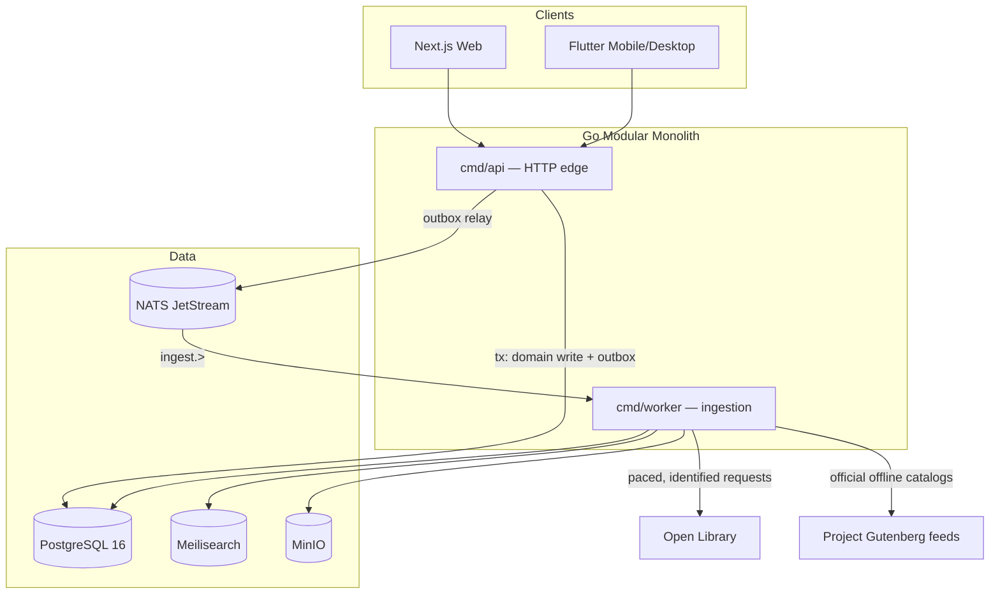

# Alexandria

**An open-source, ad-free, human-first social reading platform.**
Books are written by humans, discussed by humans, explained by humans, and
read by humans.

Alexandria is "Letterboxd for books" elevated with scholarly rigor: personal
libraries, long-form reviews, peer-reviewed scholar notes, spoiler-gated book
clubs, and an in-app reader for public-domain classics — wrapped in an
illuminated-manuscript / botanical-woodcut design language. No ads, no
engagement algorithms, no AI-generated literary content, ever.

## Monorepo

```
alexandria/
├── apps/
│   ├── api/          Go 1.22 modular monolith (chi · pgx · NATS JetStream)
│   ├── web/          Next.js 14 App Router (custom Tailwind design system)
│   └── mobile/       Flutter 3 (CustomPainter drop caps, no Material chrome)
├── packages/
│   ├── db/           PostgreSQL 16 migrations · sqlc queries (FRBR model)
│   ├── core/         Shared tokens, friction constants, types
│   └── ui/           Shared React components (graduating from apps/web)
├── infrastructure/   docker-compose (Postgres, NATS, Meilisearch, MinIO), Dockerfiles
├── docs/             ADRs · setup guide
└── turbo.json
```

## Architecture



**Key decisions** (full rationale in [`docs/adr/`](docs/adr/)):

| Decision | ADR |
|---|---|
| Modular monolith, not microservices | [0001](docs/adr/0001-modular-monolith.md) |
| FRBR: `works` → `editions`, no duplicate books | [0002](docs/adr/0002-frbr-data-model.md) |
| sqlc + pgx, explicit SQL, no ORM | [0003](docs/adr/0003-sqlc-over-orm.md) |
| Event-driven ingestion (JetStream + transactional outbox) | [0004](docs/adr/0004-event-driven-ingestion.md) |
| Anti-AI-slop = structural friction, never "AI detection" | [0005](docs/adr/0005-friction-not-detection.md) |

## The friction system (anti-slop)

Enforced at **three layers** so no buggy handler can bypass it:

- **Schema:** reviews ≥ 150 chars (`CHECK`), one review per user per work,
  scholar notes ≥ 200 chars and citation-gated, moderation actions require a
  written rationale.
- **Domain (Go, unit-tested):** half-star rating bounds, rune-based length,
  filler heuristics (repeated glyphs, low vocabulary).
- **Policy:** new accounts post 2 reviews/day; Trusted Readers (reputation ≥
  100) post 10; caps computed from an append-only `contribution_ledger`.

## Design system

Parchment `#E8DDC4` · Deep Ink `#111713` · Botanical Green `#0D3B2E` ·
Vermilion `#D9471F` · Gold `#C79522`. UnifrakturMaguntia for display, EB
Garamond for body. Sharp editorial corners (radii: 0 and 2px only), hard
offset print-block shadows, engraved SVG icons, and a deterministic
**generative drop-cap asset system** (SVG on web, `CustomPainter` on Flutter)
modeled on botanical woodcut initials — the same letter always renders the
same ornament, and any letter can be swapped for hand-drawn OFL/CC0 art
without touching call sites.

## Quick start

```sh
docker compose -f infrastructure/docker-compose.yml up -d   # Postgres+NATS+Meili+MinIO
cd apps/api && go run ./cmd/api &                            # :8080
npm install && npm run dev --workspace @alexandria/web       # :3000 (renders fixtures without the API)
```

Full guide: [`docs/SETUP.md`](docs/SETUP.md).

## Sourcing & compliance

- **Open Library:** metadata via API with identifying User-Agent, 1 req/s
  pacing, JetStream backoff on 429s.
- **Project Gutenberg:** official offline catalogs/feeds only; texts cached
  once to MinIO; never scraped, never hotlinked.
- **Covers:** rights-aware pipeline — every `cover_assets` row separates
  *source* from *license* from *cache policy*; unverified covers are replaced
  by generated house "woodcut plates."
- **Monetization:** affiliate links only, on an explicit
  Book → Purchase Options page, with disclosure. Zero display advertising.

## Licensing

- Backend, web, infrastructure: **AGPL-3.0-only** ([LICENSE](LICENSE))
- Flutter client & design tokens: **MIT** ([apps/mobile/LICENSE](apps/mobile/LICENSE))

## Roadmap

1. **Foundation** ✅ — schema, monolith, ingestion pipeline, design system, web shell
2. **MVP** — WebAuthn passkeys, Meilisearch-backed search, live library/review flows
3. **Reader** — EPUB/TXT renderer with parchment typography, annotations
4. **Community** — scholar verification + peer review, clubs with LiveKit voice/video

See [`CONTRIBUTING.md`](CONTRIBUTING.md) before opening a PR.
