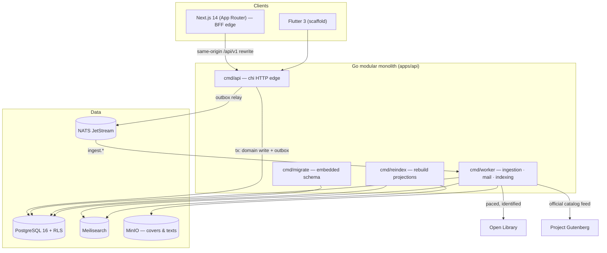

# 08 — Technical Architecture

**Status:** implemented · decisions in `docs/adr/0001–0008`

## Why a modular monolith
One binary, internal package boundaries (`domain`, `store`, `httpapi`,
`ingest`, `search`, `mailer`, `auth`, `events`), so a contributor runs the
whole platform with one `docker compose up` and one `go run`. Microservices
are a scaling decision we postpone until a measurable bottleneck names itself
([ADR 0001](../adr/0001-modular-monolith.md)).

## Sync vs async (the rule)
A request handler may: validate, read, and write one transactional unit.
Anything slow — upstream fetches, cover caching, index updates, email — is
enqueued through the **transactional outbox** and consumed from JetStream
([ADR 0004](../adr/0004-event-driven-ingestion.md)). NATS downtime delays
work; it never loses it and never stalls a page.

## Data access
sqlc is the single source of truth: SQL in `packages/db/queries/*.sql`,
generated Go committed at `apps/api/internal/db`, CI fails on drift.
`internal/store` adds only pool lifecycle, RLS-scoped transactions
(`TxUser`/`ReadUser`/`Tx`), and atomic multi-statement operations
([ADR 0003](../adr/0003-sqlc-over-orm.md)).

## Web edge
Next.js is the BFF: server components fetch with forwarded cookies; browser
traffic reaches the monolith through same-origin rewrites, keeping session
and CSRF cookies first-party (no CORS). Rewrites are baked at build time —
build with `ALEXANDRIA_API_URL` set (`docs/SETUP.md`).

## Failure philosophy
Derived state (search index, cached covers, cached texts) may be lost and
rebuilt (`cmd/reindex`). Authoritative state (Postgres) may never be
half-applied (checksummed migrations, RLS, triggers).
