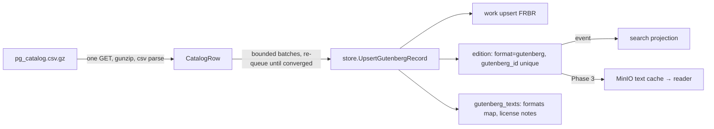

# 12 — Project Gutenberg Integration

**Status:** catalog ingestion implemented and verified against the live feed;
text caching + reader ⏳ Phase 3

## Compliance shape (non-negotiable)
- **Never crawl the website.** We consume the official offline catalog:
  `https://www.gutenberg.org/cache/epub/feeds/pg_catalog.csv.gz` — one request,
  ~5.5 MB gzipped, 90 648 rows (verified 2026-09-09). Columns, exactly:
  `Text#,Type,Issued,Title,Language,Authors,Subjects,LoCC,Bookshelves`.
- Texts, when the reader lands, are downloaded **once** from the canonical
  UTF-8 pattern `https://www.gutenberg.org/files/{id}/{id}-0.txt` (verified
  200 for etext 84) into our own object storage; the reader never hotlinks
  gutenberg.org, so their bandwidth stays flat no matter how many people read
  on Alexandria.
- License and trademark travel **as data**: every ingested edition's metadata
  carries `license_note` and `trademark_note` (Project Gutenberg™ is a
  trademark of the Project Gutenberg Literary Archive Foundation). The reading
  text is stripped of boilerplate separately from the stored notice, so the
  notice is never lost.
- Jurisdiction: `is_public_domain` means *United States* status; the UI says
  so. Life+70 territories are a legal question, not a boolean
  ([21](21-licensing-legal.md)).

## Pipeline

- Parser tolerates malformed rows (log + skip) and keeps only `Type=Text`.
- Authors/subjects split on `;` only — catalog fields embed commas inside
  quoted names ("Jefferson, Thomas, 1743-1826").
- Idempotence: `editions.gutenberg_id` partial unique index; re-running a
  catalog snapshot converges instead of duplicating.
- Bounded batches (`RUN_GUTENBERG_CATALOG=true`, 500 rows/run) so a worker
  restart never monopolizes the database.

## Reader requirements (Phase 3)
Strip PG boilerplate (header/license) into `metadata.boilerplate`, keep the
reading text clean; chapter detection by regex on the cleaned text; anchors
are `(chapter_idx, start_off, end_off)` — the annotation schema already exists
and is RLS-private.
